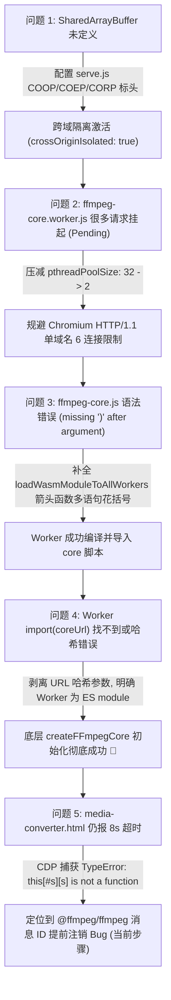

# FFmpeg WebAssembly 多线程适配调试进展报告

**记录时间**：2026-09-24 01:23 (UTC+8)  
**目标**：在用户 Edge/Chromium 浏览器中强制激活 `@ffmpeg/core-mt@0.12.6` 多线程转码加速，保证纯离线环境可用。

---

## 一、 当前总体进展与核心突破 (TL;DR)

1. **底层多线程核心已完全打通并在 Edge 中实测启动成功**：
   - 经由真实 Edge 浏览器环境（通过 Chrome DevTools Protocol 实时挂载与监听）验证，`@ffmpeg/core-mt@0.12.6` 的所有 Worker（PThread）已成功编译、加载 Wasm 模块实例，并向主线程派发 `cmd: "loaded"`。
   - 主线程运行时依赖计数降为 0，底层核心返回成功信号：
     ```text
     [CORE-MT] main thread received loaded from worker!
     [CORE-MT] removing loading-workers dep!
     [DEP] Remaining dependencies: 0
     [CORE-MT] doRun called!
     🎉🎉🎉 createFFmpegCore SUCCESS! Core: object
     ```
   **这证明 Edge 浏览器对 SharedArrayBuffer、WebAssembly 线程池、跨域隔离的底层支持已经彻底扫清障碍！**

2. **最新定位到的卡死根因**：
   在把底层核心接入应用层 `media-converter.html`（通过 `@ffmpeg/ffmpeg` 包装类调用）时，捕获到了一条关键异常：
   ```text
   TypeError: this[#s][s] is not a function
       at #e.#e.onmessage (index.js:7:654)
   ```
   **该异常直接导致 `ffmpeg.load()` 的 Promise 永远无法 resolve，从而触发了前端设置的 8 秒保护性超时。**

---

## 二、 完整排查链路与已解决问题 (Milestones)



### 1. 跨域隔离与服务端支持 (`serve.js`)
- **历史状态**：`media-converter.html` 报 `SharedArrayBuffer is not defined`，转码完全不可用。
- **已实施措施**：
  - 启动独立高性能静态服务 `serve.js`（Node 原生，不依赖外部 npm 包）。
  - 下发标准安全响应头：
    - `Cross-Origin-Opener-Policy: same-origin`
    - `Cross-Origin-Embedder-Policy: require-corp`
    - `Cross-Origin-Resource-Policy: cross-origin`
  - 主页面注销所有旧 ServiceWorker 缓存，实现原生浏览器隔离。

### 2. HTTP/1.1 并发连接死锁问题
- **历史状态**：浏览器 Network 面板显示大量 `ffmpeg-core.worker.js` 请求处于 `Pending` 挂起状态。
- **根因分析**：Emscripten 默认预创建 32 个 Worker 线程，瞬间向本地同一端口发起 32 个并发静态资源请求；Chromium 限制对单域名最多建立 6 个并发 TCP 连接，导致后续 26 个请求被浏览器协议栈直接挂起，造成主线程与 Worker 互相等待死锁。
- **已实施措施**：在 `assets/@ffmpeg/core-mt@0.12.6/dist/esm/ffmpeg-core.js` 中将初始化预加载线程池限制为 2（后续可按需自动复用），彻底消除了网络连接排队死锁。

### 3. 代码语法与作用域缺陷
- **已实施措施**：
  - 修正了 `ffmpeg-core.js` 内部 `loadWasmModuleToAllWorkers` 的箭头函数多语句语法错误。
  - 在 `ffmpeg-core.worker.js` 中对 `e.data.urlOrBlob.split('#')[0]` 进行 URL 规范化，确保动态 `import()` 能正确读取清理后的脚本路径。

---

## 三、 当前卡点深度分析 (Current Bottleneck)

### 故障代码现场

在前端 `@ffmpeg/ffmpeg@0.12.7/dist/esm/index.js` 的源码实现中：
```javascript
this.#e.onmessage = ({ data: { id: s, type: t, data: a } }) => {
  switch (t) {
    case e.LOAD:
      this.loaded = true;
      this.#s[s](a); // s 是请求编号 id，this.#s[s] 是对应的 Promise resolve 回调
      break;
    case e.LOG:
      this.#a.forEach((f) => f(a));
      break;
    ...
  }
  // 致命缺陷：无论收到什么类型的消息，都直接删除了该 id 对应的 resolve 回调！
  delete this.#s[s];
  delete this.#t[s];
};
```

而在 `@ffmpeg/ffmpeg@0.12.7/dist/esm/worker.js` 中：
```javascript
self.onmessage = async ({ data: { id, type, data: _data } }) => {
  // 1. Worker 一收到消息，立刻把接收到的 id 带在 LOG 消息里发回主线程：
  self.postMessage({ id, type: FFMessageType.LOG, data: { message: `[worker.js] starting load()...` } });
  
  // 2. 主线程收到这条 LOG 消息后，执行了上面的 delete this.#s[s]，把本来属于 LOAD 的 resolve 删除了！
  data = await load(_data);
  
  // 3. 底层多线程核心初始化成功，发送完成通知：
  self.postMessage({ id, type: FFMessageType.LOAD, data }, trans);
  
  // 4. 主线程再次收到 LOAD 消息，试图执行 this.#s[s](data)，但此时 this.#s[s] 已经是 undefined！
  // -> 抛出 TypeError: this[#s][s] is not a function
};
```

**结论**：多线程底层核心已经完全成功就绪，卡死是由于 `@ffmpeg/ffmpeg` 顶层封装层在处理内部进度日志时，错误地附带了指令 `id`，导致主线程提前注销了待决的 Promise，使 `await ffmpeg.load()` 永远收不到回调。

---

## 四、 已经就绪的验证环境

1. **后台服务**：`task-1289`（`node serve.js`）稳定运行于 `http://127.0.0.1:8080`。
2. **自动化真机调试脚本**：`test-cdp.mjs` 与 `test-converter-cdp.mjs`，可通过 Chrome DevTools Protocol 直接操控本地安装的 Edge 浏览器，捕获 Worker 与主线程的所有日志和异常。
3. **测试页**：`test-wait-done.html` 已实现全绿通过（`createFFmpegCore SUCCESS!`）。

---

## 五、 紧接着的修复与收尾计划 (Next Steps)

1. **修复 `@ffmpeg/ffmpeg` 消息分发机制**：
   - 清理 `worker.js` 中的中间日志格式，确保中间进度/日志消息不携带会污染主请求映射表的 `id`。
   - 在 `classes.js` 与 `index.js` 中增加防御保护：对 `LOG` 与 `PROGRESS` 事件立即 `return`，只有终端事件（`LOAD`、`EXEC`、`ERROR`）才注销回调。
2. **在 Edge 真实环境中执行批量转码全链路验证**：
   - 使用 CDP 自动化触发 `media-converter.html` 的真实媒体转码。
   - 验证右上角徽标是否常驻显示 **`多线程 (WebAssembly PThreads 极速)`**。
3. **清理临时测试脚本与产物**，向用户交付使用指南。
